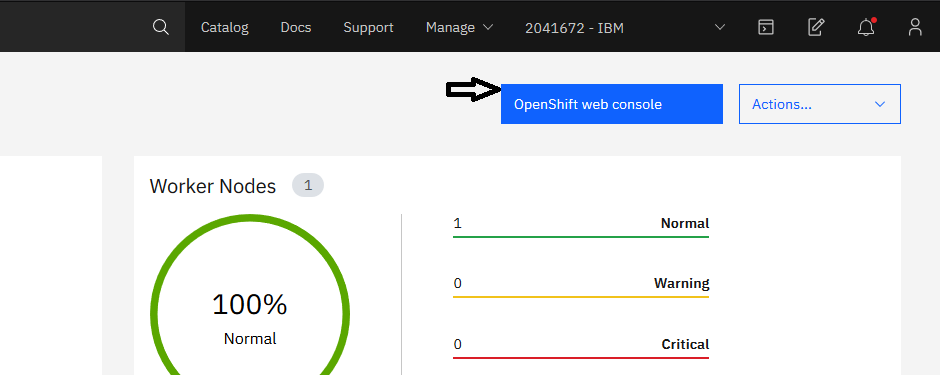
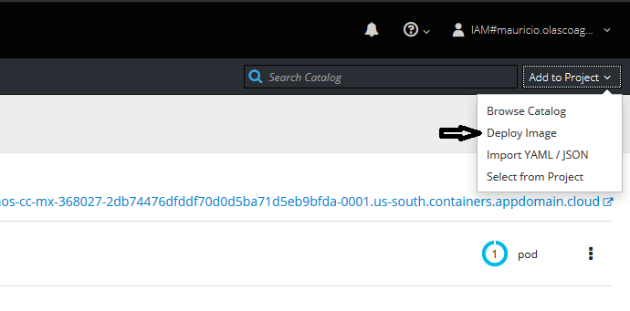
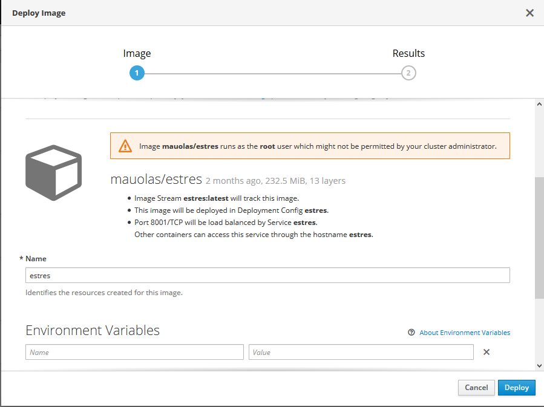
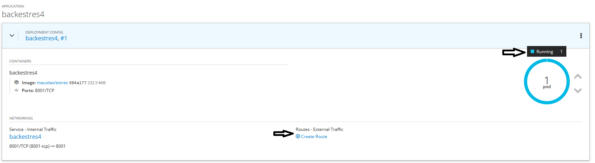
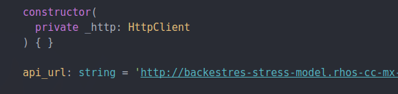
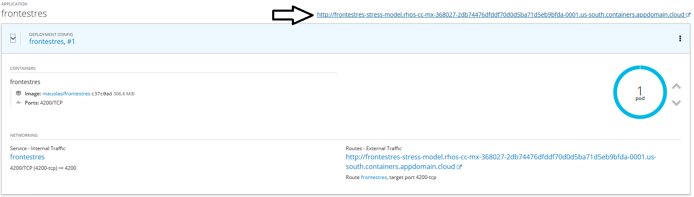
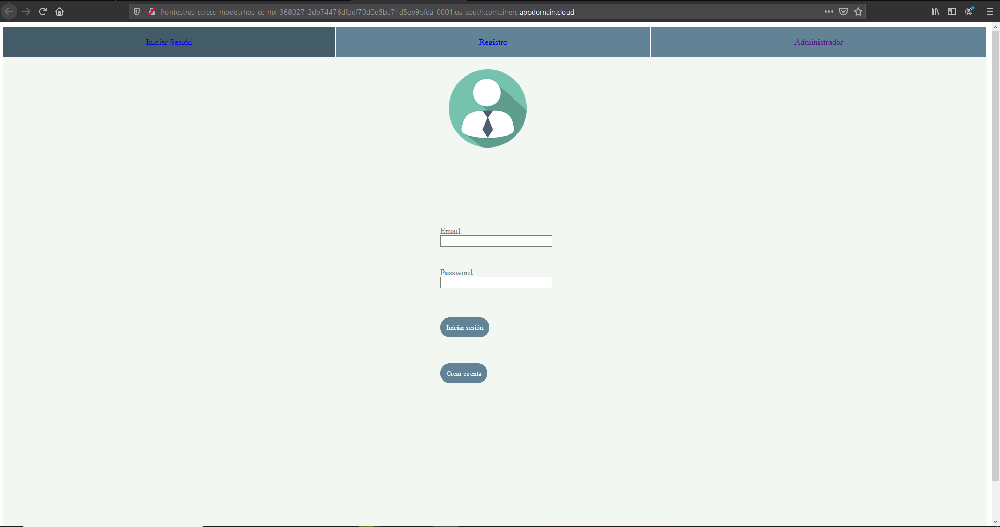

# STRESS_MODEL-JTC-CC-MX
Asset creado con el fin de demostrar la compatibilidad de Open Shift con programas de OpenSource como DockerHub.

Stress Model tiene 3 componentes escenciales:\
Front-End: Angular\
Back-End: Flask(Python 3.7)\
Servicio de Watson: Watson Tone Analyzer

# PASOS
## BACKEND
## 1

Construcción de **backend** con Docker. Comando:\
docker image build -t {Nombre usuario Dockerhub}/backend:latest .\
Es muy importante por en punto al final para referenciar el comando.

## 2

Empujar imagen local del **backend** a Dockerhub con el siguiente comando:\
docker push {Nombre usuario Dockerhub}/backend:latest \
El nombre en ambos comandos deben estar compuestos de la siguiente manera {Nombre usuario Dockerhub}/{nombre de imagen}.\Ya que  esto falicita la hora de empujar esta imagen a dockerhub y otras plataformas.\
Ejemplo:\
docker image build -t juan/backend:latest .

## 3

Ahora ingresamos a nuestra consola de openshift.\

Una ves adentro despues de crear nuestro ambiente donde se alojaran los microservicios del back y front.\
Buscaremos en un sub menu que dice "Add to project" un boton que dice "Deploy image" ubicado en la parte superior derecha de esta.\

Al ingresar a este boton, nos desplegara una nueva ventana y en una de las opciones se visualizara "Buscar imagen".\
Ingresamos el nombre con el cual tenemos el repositorio en Dockerhub. Si la encuentra te dara todas las especificaciones de esta imagen y hasta abajo de esta ventana le damos click al boton deploy.\

## 4

Una ves que el deploy este completado, esto que quiere decir, que cuando veamos el pod diga running.\
Expandiremos las opciones de este pod con la flecha que se encuentra a la izquierda de este, y en la parte inferior dira crear ruta.\
Creamos la ruta para poder accesar a este pod desde el front.

## FRONTEND

## 1
Ahora para empezar la construccion del **FrontEnd** ingresaremos al codigo del front y esta nueva ruta creada para el back end previamente se ingresara en el **frontend** en el archivo condireccion "src/app/services/api.service.ts"\
En este archivo pondremos esta ruta de la siguiente forma 

api_url: string = '**********Ruta del backend***********' \

## 2

Una ves ingresada esta ruta en el codigo procederemos a la construcción de la imagen del **FrontEnd**.\
Usamos el siguiente comando con Docker:\
docker image build -t {Nombre usuario Dockerhub}/frontestres:latest .\
Recuerda poner el punto al final.

## 3

Empujar imagen local del **FrontEnd** a Dockerhub con el siguiente comando:\
docker push {Nombre usuario Dockerhub}/frontestres:latest 

## 4

Ahora ingresamos a nuestra consola de openshift.\

Una ves dentro del ambiente donde colocamos previamente el back.\
Haremos el deploy del **FrontEnd**. Si tienes alguna duda consulta el paso tres del BackEnd, ya que tenemos que replicar los pasos a seguir.

## 5

Una ves que el deploy este completado, esto que quiere decir, que cuando veamos el pod diga running.\
Expandiremos las opciones de este pod con la flecha que se encuentra a la izquierda de este, y en la parte inferior dira crear ruta.\
Creamos la ruta para poder acceder al **FrontEnd**

## 6

Una ves creada la ruta podremos ingresar en ella.\

## Listo, lograste hacer el deploy completo.

