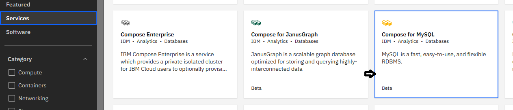
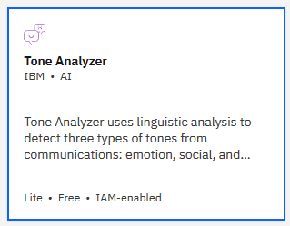
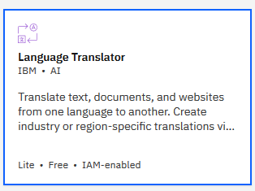
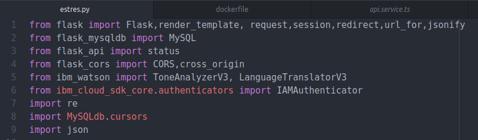
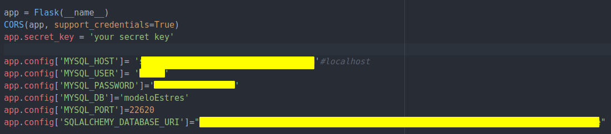
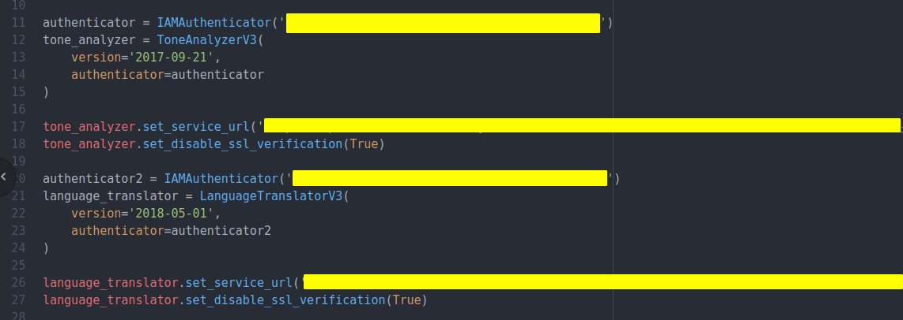
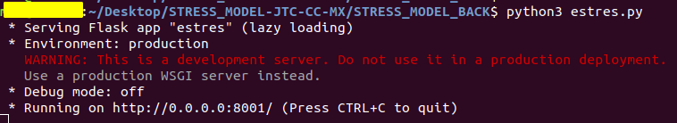

# STRESS_MODEL_BACK-JTC-CC-MX

Aplicativo creado en flask, framework de python 3.7 orientado a micro servicios.

# Dependecias:
https://pypi.org/project/Flask/ \
flask,
ibm-watson,
flask_mysqldb,
mysqlclient,
flask_api,
flask_cors,
Unidecode.

# Base de datos
Conectado a base de datos Mysql por medio de credenciales.\
Para crear esta base de datos en la nube IBM es de la siguiente forma.\

# Api's de Watson
Watson tone analyzer.\
Watson language translator\
Para crear estos servicios en la nube de IBM es de la siguiente forma.\
\

# Pasos para correr aplicativo
## Instalar dependencias
pip install flask\
pip install flask_mysqldb\
pip install mysqlclient\
pip install flask_api\
pip install flask_cors\
pip install Unidecode\
pip install ibm_watson

Y agregarlas al codigo cons sus librerias respectivas.

## Enlazar a base de datos
En este proyecto se enlazo a una base de datos alojada en la nube IBM.\
Se puede hacer con cualquier base de datos alojada en algun servidor. Ya que en el programa se enlazo a base de credenciales.\
Las credenciales se consiguen se consiguen directamente de tu base de datos.\
En este caso se usaron las credenciales que nos fueron proporcionadas por la base que tenemos alojada en la nube de IBM.\

## Enlazar a api's de Watson Studio
Para terminar es necesario enlazar el back a los api's ocupados por el back de Watson.\
Es necesario tener las credenciales necesarias proporcionadas por el servicio que se usara.\
En este caso se enlazaron con las credenciales que nos proporcionaron los servicios alojados en la nube de IBM.\
A continuación el ejemplo

## Finalizar
Finalizando una ves teniendo instalado correctamente. La manera de correr el programa sería: python{version} estres.py

