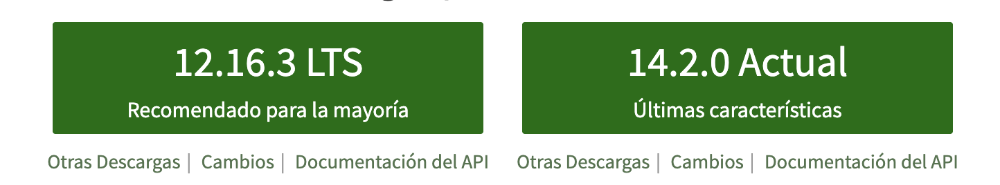
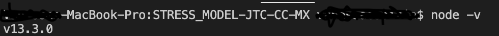
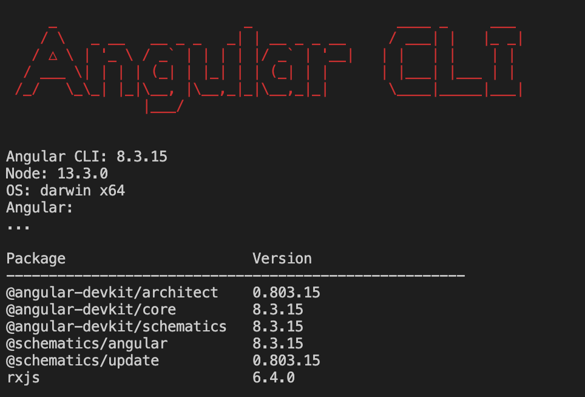
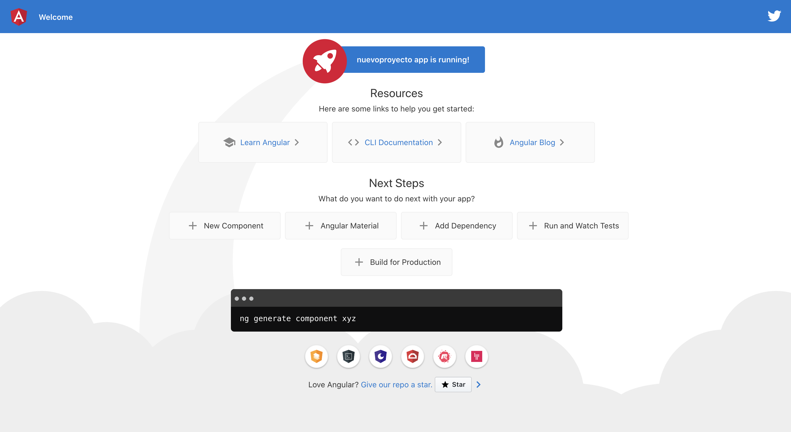
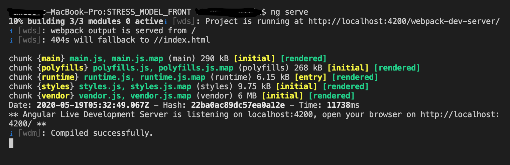
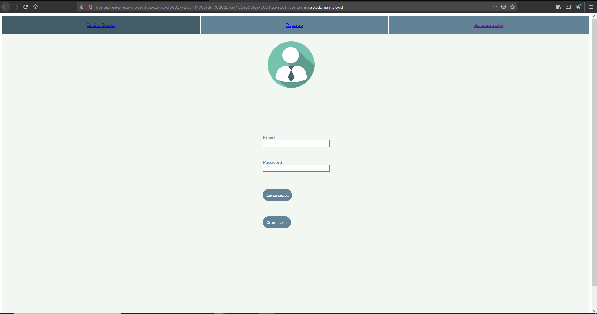
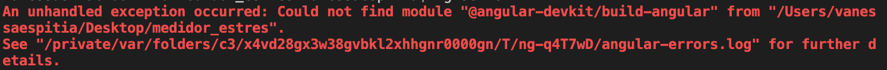

# STRESS_MODEL_BACK_JTC_CC_MX

Este proyecto esta Generado en [Angular CLI](https://github.com/angular/angular-cli) version 8.3.15.

# Medidor Estrés

Este proyecto es muy amigable con el usuario, tiene un inicio de sesión y un registro de usuarios, así mismo te despliega los resultados necesarios.

Si se hace la encuesta al terminarla te saldrán los resultados mediante lo respondido.

Cuando se te da acceso a ser administrador se te mostraran los resultados correspondientes de cada sector.

# Pasos para Correr el Aplicativo.
## Instalar Dependencias

# Paso 1. 
Instalar NodeJS en su ultima versión, para eso entraremos a su web oficial y descargaremos el instalador más actualizado https://nodejs.org/es/

verficar que se tenga una versión arriba del 13

node -v

# Paso 2. 
Instalar la última versión de Angular CLI para instalar Angular 8:

npm install -g @angular/cli

# Si ya se cuenta con Angular pero una version menor a 7

 debe ejecutar:

Actualizar NPM, el gestor de paquetes de node, para bajarnos las dependencias más actuales:

npm install -g npm@latest

Borrar la cache de NPM:

npm cache clean --force

Desactivar las auditorias de NPM para evitar fallos:

npm set audit false

Desinstalar los paquetes anteriores de Angular CLI

npm uninstall -g angular-cli

npm uninstall -g @angular/cli

Borrar la cache de NPM de nuevo:

npm cache clean --force

Instalar la última versión de Angular CLI para instalar la versión de Angular:

npm install -g @angular/cli@latest

# Prueba si se instaló Angular. 

Crear un nuevo proyecto

ng new nombre-proyecto

# Correr el servidor de Angular.
Correr el programa escribirendo en terminal

ng serve -o

# Correr el proyecto

Al clonar el proyecto de GIT posicionarse en la carpeta STRESS_MODEL_FRONT

correr el proyecto con:

ng serve -o

# *En caso de error:

Escribir en terminal

npm install --save-dev @angular-devkit/build-angular - 

